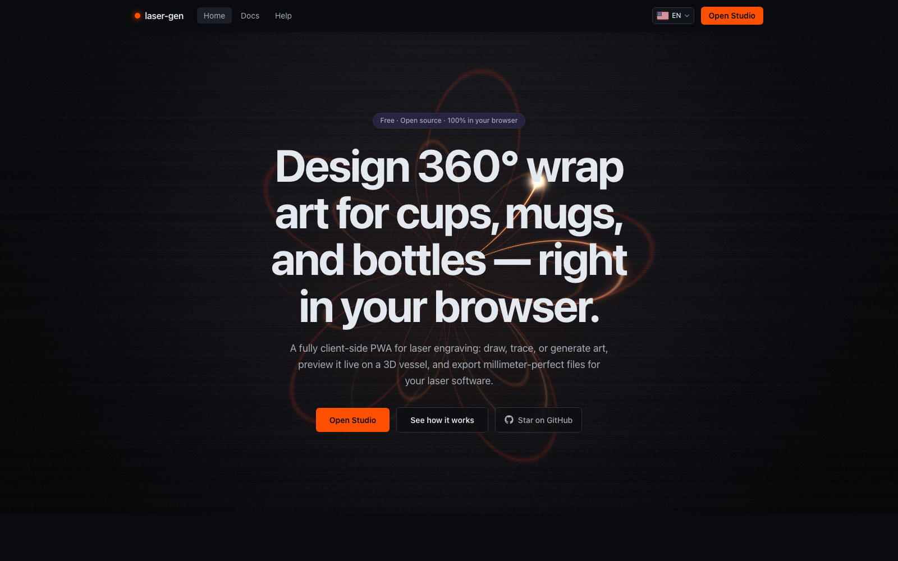

# laser-gen

**Design 360° wrap art for laser engraving — fully in your browser.**

laser-gen is a free, open-source, fully client-side Progressive Web App for laser-engraving
hobbyists and professionals. It helps you create wrap-around artwork for cups, mugs, tumblers,
and bottles (Stanley tumblers, anyone?), vectorize images, prepare photos for engraving, and
export files ready for LightBurn, xTool Creative Space, and LaserGRBL.

No accounts. No servers. No uploads. Your projects and your API keys never leave your device.

<!-- Badges -->
[](https://github.com/bloodf/laser-gen/actions/workflows/ci.yml)
[](LICENSE)
[](https://nuxt.com)
[](CONTRIBUTING.md)

## Features

| Area | What you get |
| ------------------- | -------------------------------------------------------------------------------------------------------------- |
| **Wrap studio** | mm-accurate 2D canvas that maps exactly onto your vessel's surface: pen, rect, ellipse, polygon, star, freehand, live text, layers, snapping, seam & handle-safe-zone guides, undo/redo with IndexedDB autosave |
| **Vessels** | Parametric lathe profiles from real millimeter dimensions, with community presets (Stanley Quencher 30/40 oz, camp mug, classic ceramic mug, beer stein 24 oz, stacking beer pint 16 oz with steel rim, wine tumbler, sports bottle, carabiner sport bottle 750 ml, screw-cap and cola-shape insulated bottles, 750 ml water bottle, straight cylinder) — plus a custom vessel builder: measure diameter *or* circumference at the bottom and (for tapered vessels) the top |
| **3D preview** | Live TresJS/three.js vessel with your wrap applied as a texture — parametric lathes with multi-part extras (rim bands, caps, carabiners) or GLB-backed models for the two mugs — turntable, laser-sweep animation, finish materials with a custom powder-coat color picker, seam & safe-zone overlays |
| **Vectorize** | In-browser raster→vector tracing (imagetracerjs in a Web Worker) with threshold, smoothing, and simplify controls |
| **Photo prep** | Grayscale, levels/contrast, sharpening, dithering (Floyd–Steinberg, ordered, halftone, stipple), material presets, corner flood-fill background removal, halftone→vector dots |
| **Export** | Physical-size SVG with per-program presets for LightBurn, xTool Creative Space, and LaserGRBL; DPI-correct raster PNG (pHYs chunk); rotary setup metadata embedded in the file plus a copy/download rotary-setup panel |
| **Library** | Local-first project library (IndexedDB): thumbnails, tags, status, job tracker with burn attempts, reusable assets, versioned JSON import/export |
| **AI (BYOK)** | Optional assistant — Anthropic, OpenAI, or any OpenAI-compatible endpoint: prompt→SVG, prompt→image, design copilot. Keys are encrypted at rest and never leave your device |
| **PWA** | Offline-first installable app (Workbox, auto-update) |
| **i18n** | English, Português, Español, Deutsch, 日本語, 中文 |

### Known limits (honest list)

- **Text stays live `<text>`** — exports reference font-family stacks; text is not
  converted to outlines, so exact rendering depends on the fonts on the laser PC.
- **No boolean path operations** (union/subtract/intersect) yet.
- **Background removal is a local corner flood fill** — great for solid backgrounds,
  not for complex scenes. (AI-provider background removal is on the roadmap.)
- **HEIC photos are not supported** — browsers can't decode them natively; convert to
  PNG/JPEG first.
- **Vectorizer is imagetracerjs (JS)** — a WASM potrace/vtracer-class upgrade is planned.

## Quickstart

Prerequisites: **Node.js 22+** and **pnpm 10+**.

```bash
git clone https://github.com/bloodf/laser-gen.git
cd laser-gen
pnpm install
pnpm dev
```

Then open http://localhost:3000.

Other scripts:

| Command              | What it does                                          |
| -------------------- | ----------------------------------------------------- |
| `pnpm dev`           | Start the dev server                                  |
| `pnpm build`         | Production build                                      |
| `pnpm generate`      | Static site generation (deployable PWA)               |
| `pnpm preview`       | Preview the production build                          |
| `pnpm lint`          | ESLint (flat config)                                  |
| `pnpm typecheck`     | `vue-tsc` type checking                               |
| `pnpm test`          | Vitest unit tests                                     |
| `pnpm test:e2e`      | Playwright e2e (builds + previews automatically)      |
| `pnpm i18n:check`    | Verify locale key parity against `en.json`            |
| `pnpm screenshots`   | Recapture the README screenshots below                |

## Deployment

laser-gen is fully client-side — deploy the `pnpm generate` output to any static host.
A ready-made `vercel.json` is included for one-command Vercel deploys; see
[docs/deployment.md](docs/deployment.md) for Vercel, Cloudflare Pages, and GitHub Pages.

## Tech stack

| Layer       | Choice                                                        |
| ----------- | ------------------------------------------------------------- |
| Framework   | Nuxt 4 (SPA mode, `ssr: false`), Vue 3, TypeScript strict     |
| Styling     | Tailwind CSS 4 (CSS-first `@theme`, OKLCH colors)             |
| State       | Pinia + pinia-plugin-persistedstate                            |
| PWA         | @vite-pwa/nuxt (Workbox, offline-first, auto-update)          |
| i18n        | @nuxtjs/i18n v10 (lazy JSON locales)                           |
| Quality     | ESLint 9 flat config, vue-tsc, Vitest, Playwright + axe-core        |
| Package mgr | pnpm                                                           |

## Screenshots

<p align="center">
  
</p>
<p align="center">
  
</p>
<p align="center">
  
</p>

## Documentation

- [Architecture](docs/architecture.md) — how the app is (and will be) structured
- [Wrap math](docs/wrap-math.md) — the cylinder/cone unwrap concept
- [Adding a vessel](docs/adding-a-vessel.md)
- [Adding a language](docs/adding-a-language.md)
- [AI providers (BYOK)](docs/ai-providers.md)
- [Roadmap](ROADMAP.md) · [Contributing](CONTRIBUTING.md) · [Changelog](CHANGELOG.md)

## Contributing

Contributions are very welcome — code, translations, vessel presets, docs, and bug reports.
Please read [CONTRIBUTING.md](CONTRIBUTING.md) and our
[Code of Conduct](CODE_OF_CONDUCT.md) first.

## Credits

The 3D preview models in `public/models/` are community works from
[Sketchfab](https://sketchfab.com), licensed
[CC-BY-4.0](https://creativecommons.org/licenses/by/4.0/) (see [NOTICE.md](NOTICE.md)):

- **[Plain Mug](https://sketchfab.com/3d-models/plain-mug-19c8fe5702b544d0a1409d3dac1cf90e)**
  by [LightSwitch](https://sketchfab.com/edwardlewis450)
- **[Stanley Mug](https://sketchfab.com/3d-models/stanley-mug-54bd8c61fadc44919e9b9da949295d3f)**
  by [Lime Zigubre](https://sketchfab.com/LimeZigubre)

## License

[MIT](LICENSE) © laser-gen contributors
