# laser-gen user guide

The complete manual for designing 360° wrap art with laser-gen — the same content as the
in-app **Docs** section, in markdown for GitHub readers. Everything runs in your browser;
nothing leaves your device unless you export it yourself.

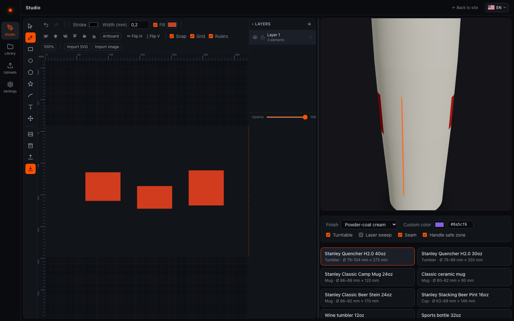

## Contents

1. [Getting started](#getting-started)
2. [The studio](#the-studio)
3. [Vessels](#vessels)
4. [Photo prep](#photo-prep)
5. [Vectorizing](#vectorizing)
6. [Exporting](#exporting)
7. [Uploads](#uploads)
8. [AI providers (BYOK)](#ai-providers-byok)
9. [Library & jobs](#library--jobs)

## Getting started

From zero to first burn in about five minutes:

1. **Pick a vessel.** Open the Studio and choose a preset in the vessel switcher on the
   right — or click **Custom vessel** and enter your own measurements. The artboard
   resizes to that vessel's engrave window.
2. **Design.** Draw with the toolbar tools, import an SVG, prep a photo in the photo
   panel, or ask the AI assistant. Everything you place maps straight onto the vessel's
   surface.
3. **Preview.** Watch the live 3D preview: wrap, seam and handle safe zone update as you
   edit. Drag to rotate and check the full 360°.
4. **Export.** Click **Export** and download the SVG with the preset for your laser
   software. The file carries real millimeter dimensions.
5. **Burn.** In LightBurn's rotary setup, enter the object diameter from the export
   dialog's Rotary tab, frame the job, and burn.

### The wrap concept

The artboard is the vessel's outer surface unrolled flat: its width equals the
circumference at the widest engraved row, its height the engrave window. The left and
right edges are the same line on the vessel — the **seam** — and elements that cross an
edge wrap automatically, so continuous patterns stay continuous. See
[wrap-math.md](wrap-math.md) for the geometry.

### Works offline

laser-gen is an installable PWA: the whole app is cached on your device and every project
is stored locally in IndexedDB. Design on the shop network — or with no network at all.

## The studio

The studio is where wraps are made: a millimeter-accurate artboard that is the vessel's
surface unrolled flat, plus a live 3D preview.

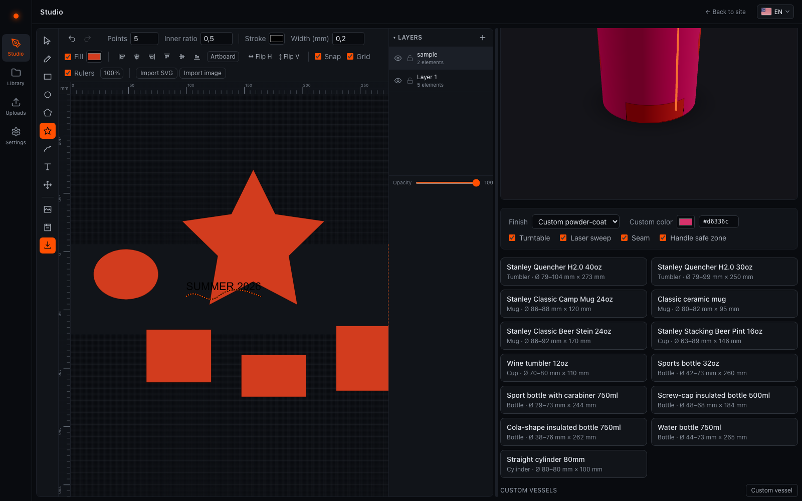

### Tools

| Tool | What it does |
| --- | --- |
| **Select** | Click to select, move, resize and rotate elements. Double-click a path to edit its nodes. |
| **Pen** | Place nodes one click at a time — double-click or press Enter to finish the path. |
| **Rectangle** | Drag out rectangles and squares. |
| **Ellipse** | Drag out ellipses and circles. |
| **Polygon** | Regular polygons — set the side count in the tool options bar. |
| **Star** | Stars — points and inner ratio in the tool options bar. |
| **Freehand** | Draw freehand strokes; smoothing (RDP simplification) is configurable in the tool options. |
| **Text** | Click anywhere and type. Text stays live and editable — exports reference font stacks, so the laser PC needs a similar font installed. |
| **Pan** | Drag the artboard around. Hold Space with any tool for temporary pan; zoom with the mouse wheel. |

### Layers

Every element lives on a layer — and layers map to assignable layers in LightBurn, so
split line art, fills and photos across layers to get separate power/speed settings per
pass. The layers panel adds, reorders, duplicates, locks, hides and deletes layers, and
sets per-layer opacity.

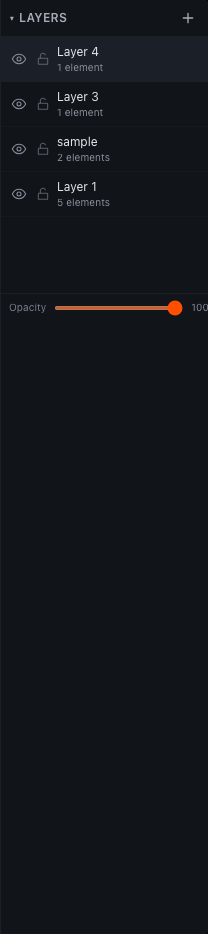

### Align & distribute

Select multiple elements and use the align, distribute and flip controls in the tool
options bar to line them up or space them evenly — horizontally, vertically, or across
the full wrap.

### Seam & safe zone

The dashed vertical lines mark the seam: the artboard's left and right edges are the same
line on the vessel. On mugs, the handle safe zone is shown as a guide in the editor and
the 3D preview — keep critical art out of it.

### Importing SVG & images

The import menu in the toolbar merges an SVG file into the active layer — files are
sanitized on import (scripts and external references stripped). PNG/JPG photos land via
the Photo button and open the photo pipeline; SVGs can also be stored as library assets
on the Uploads page.

### Live 3D preview

The right column renders the active vessel with your wrap as its texture — turntable
rotation, a laser-sweep animation, seam and safe-zone overlays, finish materials and a
custom powder-coat color.

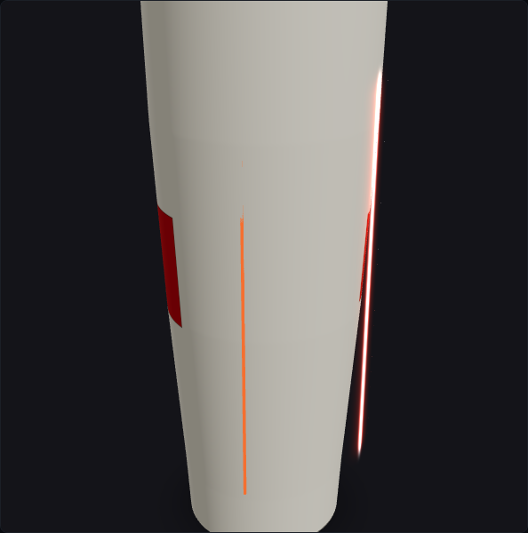

### Keyboard shortcuts

| Action | Keys |
| --- | --- |
| Temporary pan (hold) | `Space` |
| Undo | `Ctrl/⌘ Z` |
| Redo | `Ctrl/⌘ Shift Z` (or `Ctrl Y`) |
| Select all elements | `Ctrl/⌘ A` |
| Cancel / clear selection | `Esc` |
| Delete selection | `Del` / `⌫` |
| Nudge selection by 1 mm | `←` `↑` `↓` `→` |
| Nudge selection by 10 mm | `Shift` + arrows |

## Vessels

Presets spare you the calipers: pick a vessel and its profile drives both the 3D preview
and the artboard. The current preset list lives in the in-app **Docs → Vessels** page and
in [`app/core/geometry/presets.ts`](../app/core/geometry/presets.ts).

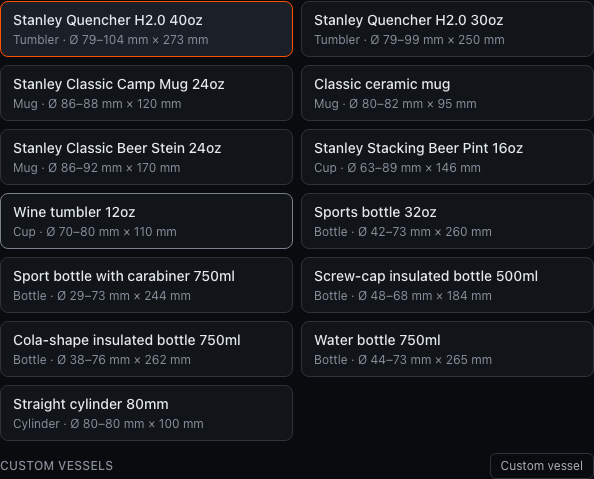

Preset dimensions are approximate community measurements, not manufacturer specs — for
production work, measure height and diameter at a few points with a ruler or calipers.
Wall taper changes the circumference your art wraps across.

### Custom vessels

Measure your vessel and click **Custom vessel** in the switcher. Enter diameter *or*
circumference — circumference is often easier: wrap a tape measure around the cup and the
app divides by π for you. Tapered vessels (most tumblers) need the diameter at both the
bottom and the top of the engrave window; straight cylinders need just one. Set the
engrave window to the band you can actually burn — below the lip, above the base step.

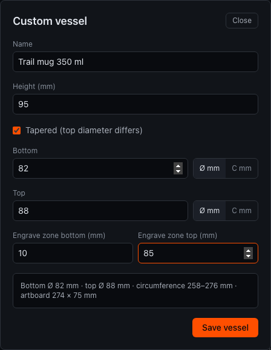

Custom vessels persist on this device and behave exactly like presets: they drive the
artboard size, the 3D preview and the rotary numbers in the export dialog.

### Finishes & custom colors

The finish selector under the 3D preview switches between powder-coat colors and bare
stainless; **Custom powder-coat** unlocks the color picker, which tints the vessel and
the wrap texture to match your real cup. The choice is cosmetic — it never changes the
exports.

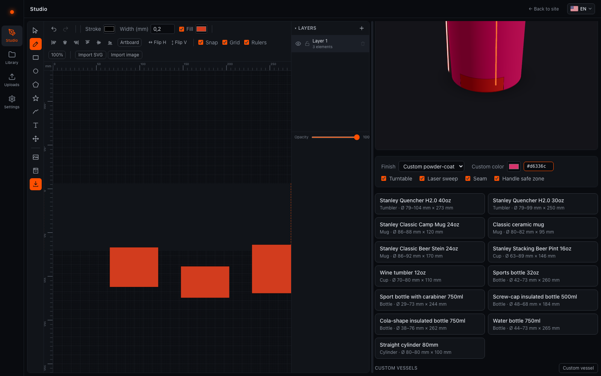

### 3D model credits

The camp mug and classic ceramic mug presets render community 3D models from Sketchfab,
licensed CC-BY-4.0 ("Stanley Mug" by Lime Zigubre, "Plain Mug" by LightSwitch — see
[NOTICE.md](../NOTICE.md)). All other vessels are parametric lathe profiles rendered by
laser-gen itself.

## Photo prep

The photo pipeline turns a PNG or JPG into something a laser can burn: grayscale, tone
adjustments and a dither matched to your material.

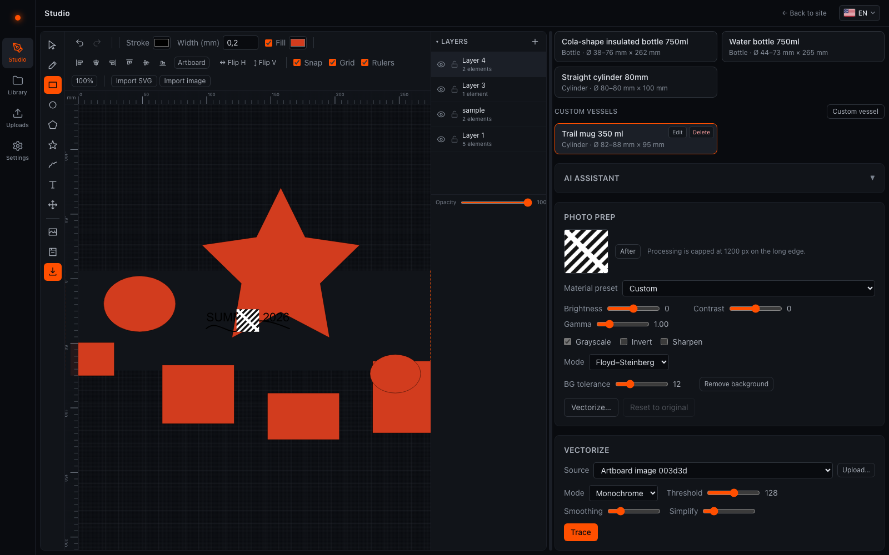

- **Import.** Use the Photo button in the studio toolbar (or drop a file on the
  artboard). Processing is non-destructive: the pristine original stays attached to the
  element and **Reset** restores it at any time.
- **Tone.** Brightness, contrast and gamma shape the midtones; grayscale, invert and
  sharpen prepare tricky sources. Everything re-renders live in a Web Worker.
- **Material presets.** Presets bundle a mode and tone curve per material —
  powder-coated steel, bare stainless, wood, glass and coated ceramic ship built in.
  Engraving convention: black pixels are where the laser fires; invert flips that for
  materials that turn bright under the beam (like glass).

### Dither modes

Lasers can't print gray — dithering fakes it with dots:

| Mode | Best for |
| --- | --- |
| **None** | Plain grayscale; only for workflows that dither downstream. |
| **Threshold** | A hard black/white cut at a level you set. Logos, stencils, text. |
| **Floyd–Steinberg** | Error-diffusion dither, the best-looking photos on coated metal and wood. The default for a reason. |
| **Bayer 4×4 / 8×8** | Ordered dither with a visible crosshatch texture; a stylistic choice (the wood preset uses it). |
| **Halftone** | A classic dot grid with adjustable cell size. The choice for slate, glass and ceramic — and the only mode that converts to vector dots. |
| **Stipple** | Sparse random dots, tuned by density. A delicate look on light materials. |

### Halftone → vector

Halftone mode can convert its dot grid into a layer of real vector circles —
resolution-independent dots for SVG export. Keep the cell size reasonable: tens of
thousands of dots get heavy, and the conversion is capped for safety.

### Background removal

Remove background flood-fills from the image corners with a tolerance slider — great for
solid studio backgrounds, not for complex scenes. If it eats your subject, lower the
tolerance and try again.

## Vectorizing

The vectorizer traces raster images into vector paths — in your browser, in a Web Worker,
with imagetracerjs.

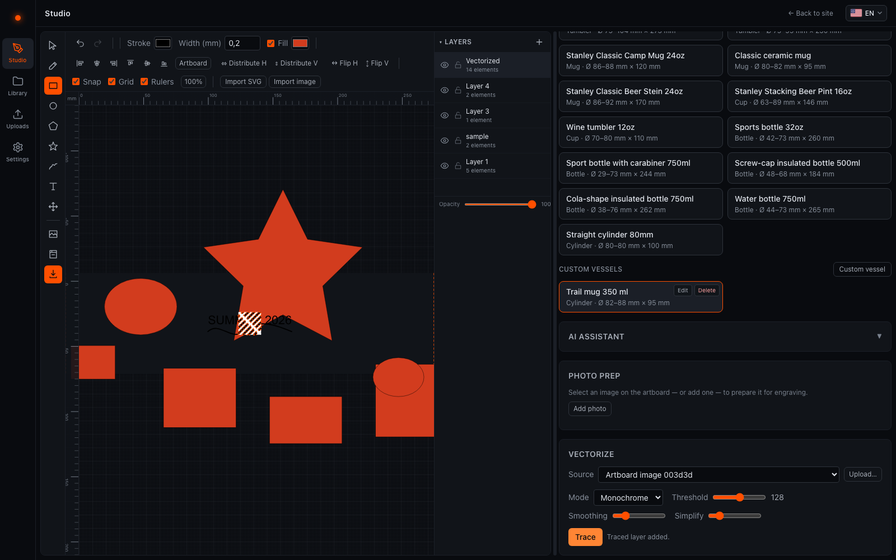

- **Mono** traces at a single brightness threshold — the right choice for logos, stamps
  and silhouettes. **Color** quantizes to a palette (2–32 colors) for multi-tone art.
  Smoothing rounds the traced paths; simplification (RDP) drops redundant nodes.
- The trace lands as a new layer fitted over the source image — the white background is
  dropped automatically. Hide or delete the raster layer afterwards.
- **Vectorize flat art** (logos, icons, text — vector paths scale losslessly and engrave
  as crisp lines); **dither continuous tones** (photos, gradients — a traced photo
  becomes banded poster art).

## Exporting

Exports are sized in real millimeters, so your laser software imports them 1:1 — no
rescaling, no guessing.

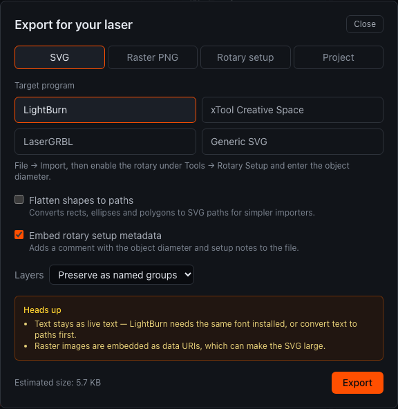

### SVG

Physical-size SVG (width/height in mm plus a viewBox). Pick the preset for your program:

| Program | What changes |
| --- | --- |
| **LightBurn** | Layers preserved as named groups — assign power and speed per layer. |
| **xTool Creative Space** | Layers merged into one group and shapes flattened to paths — XCS prefers a simple structure. |
| **LaserGRBL** | Merged, all colors forced to black — GRBL treats everything as one engrave. |
| **Generic** | Exported as-is. |

Options: flatten shapes to paths, embed rotary metadata as a comment, and override the
layer mode. The dialog shows live warnings (live text needs the font on the laser PC;
rasters embed as data URIs) and a file-size estimate.

### Raster PNG

The flat artboard rendered at 254/300/600 DPI with the DPI embedded as a pHYs chunk —
programs that honor PNG resolution import at the correct physical size. The right choice
when the design relies on dithered photos.

### Project backup

Download the working document as `.lasergen.json`, or save a copy to the library.
Re-import project files from the Library page.

### Rotary setup

The Rotary tab computes everything your laser software's rotary setup asks for — and the
same numbers are embedded in the SVG metadata comment. For LightBurn:

1. Note the **object diameter** and circumference shown in the Rotary tab (or download
   the `.txt` summary).
2. In LightBurn: **Laser Tools → Rotary Setup**, enable the rotary and choose roller or
   chuck.
3. Enter the object diameter — LightBurn derives steps-per-rotation from it.
4. Import the exported SVG; it arrives at exactly the artboard size.
5. Frame the job — tape a test band if it's your first run on this vessel — and burn.

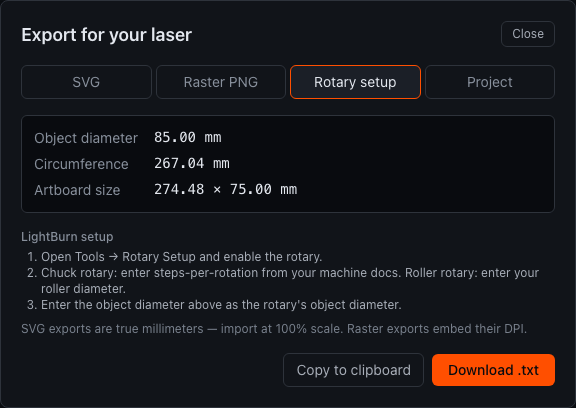

## Uploads

Uploads bring your own files into the library: 3D models become vessels, images become
art assets. Files never leave this device.

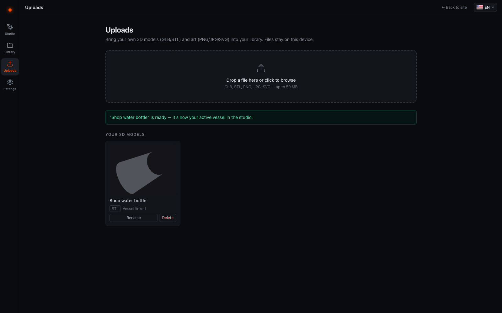

- **GLB & STL vessels.** Drop a model and the calibration form asks for the real-world
  max diameter (or circumference), height, engrave zone and category. The model is scaled
  to those millimeters — that calibration keeps the wrap preview and the exports
  accurate. Saving creates a library asset and a linked custom vessel in the studio's
  switcher. GLB models may carry multi-part materials; STL wraps as a single piece (the
  whole mesh takes the texture) and is assumed Z-up.
- **Images & SVG.** PNG/JPG uploads become photo assets and SVG uploads become sanitized
  svg-layer assets — insert them onto the artboard from the Library's assets tab.
- **Limits.** Files above 20 MB warn, above 50 MB are rejected. Model blobs don't travel
  with the library JSON export — re-upload them after restoring a backup on another
  device.

## AI providers (BYOK)

The AI assistant is strictly optional and bring-your-own-key: your browser talks directly
to the provider you configure. Keys are encrypted at rest (AES-GCM in IndexedDB), never
shown again after saving, and sent only to their own provider over HTTPS. See
[ai-providers.md](ai-providers.md) for the full model and [SECURITY.md](../SECURITY.md)
for the threat model.

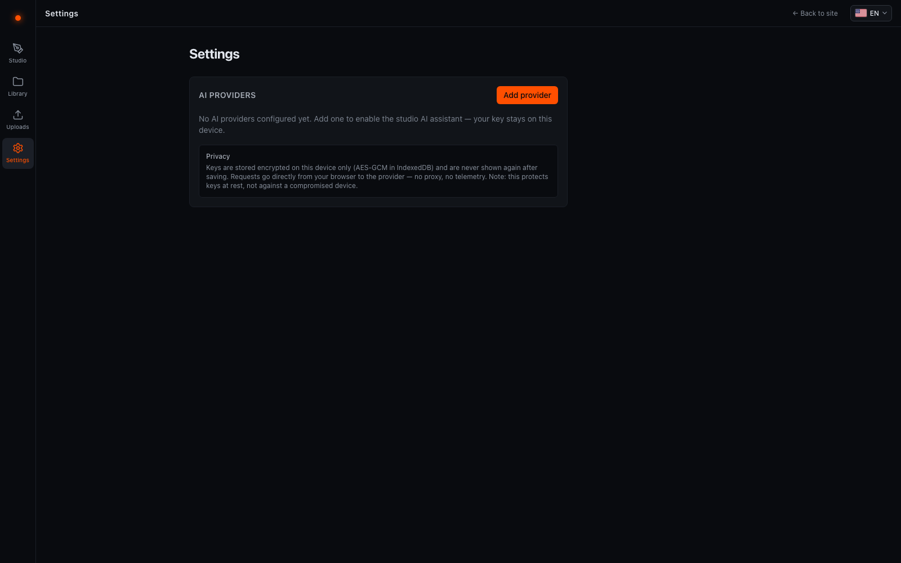

### Setup

Open **Settings → AI providers → Add provider**. Every entry needs a label and a model
id; the rest depends on the kind:

- **Anthropic** — create a key at console.anthropic.com and paste it; the default chat
  model is `claude-sonnet-4-5`.
- **OpenAI** — create a key at platform.openai.com. Also unlocks prompt-to-image via
  `gpt-image-1`.
- **Custom** — any OpenAI-compatible chat-completions endpoint: Ollama
  (`http://localhost:11434/v1`), LM Studio, OpenRouter, vLLM, corporate gateways. Needs a
  base URL and model id; the key is optional if the endpoint doesn't require one.

Then hit **Test connection**: a green dot means the browser really reached the endpoint,
and failures name the cause — bad key, network, or CORS. Local servers like Ollama must
send CORS headers (start it with `OLLAMA_ORIGINS="*"` for local use).

### Features

- **Prompt → SVG** — describe line art ("mountain range band, 20 mm tall") and it lands
  as a sanitized vector layer, fitted to your artboard.
- **Prompt → image** (OpenAI only) — generates a raster onto the artboard, one click
  away from the Vectorize panel.
- **Copilot** — a chat that knows your current document and can run a small fixed command
  set (`addText`, `resizeToFit`, `tile360`) — each action reported line by line, never
  executed silently.
- Every generation can be saved to the library as an asset.

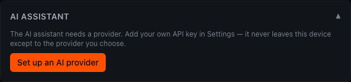

## Library & jobs

The library is your local-first project shelf: every project, asset and burn job lives in
IndexedDB on this device.

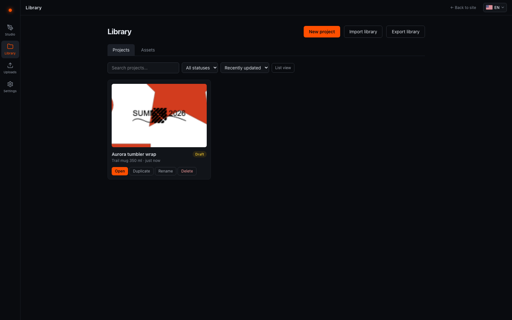

- **Projects.** Save from the studio toolbar, then search, tag, duplicate, rename and
  set a status. Each card shows a live-rendered thumbnail of the wrap.
- **Job tracker.** Open a project to log burn attempts: material, power, speed, passes,
  notes and result photos. The tracker is where "which settings worked on the black
  Stanley?" gets answered once, permanently.
- **Assets.** Reusable art: imported SVGs, photos, AI generations and your uploaded 3D
  models. Insert them into any project, or send a model to the studio as your active
  vessel.
- **Backup & transfer.** Export the whole library as one versioned JSON file and import
  it on another device. Photos and SVGs travel inside the JSON; 3D model blobs do not —
  re-upload those after an import.
